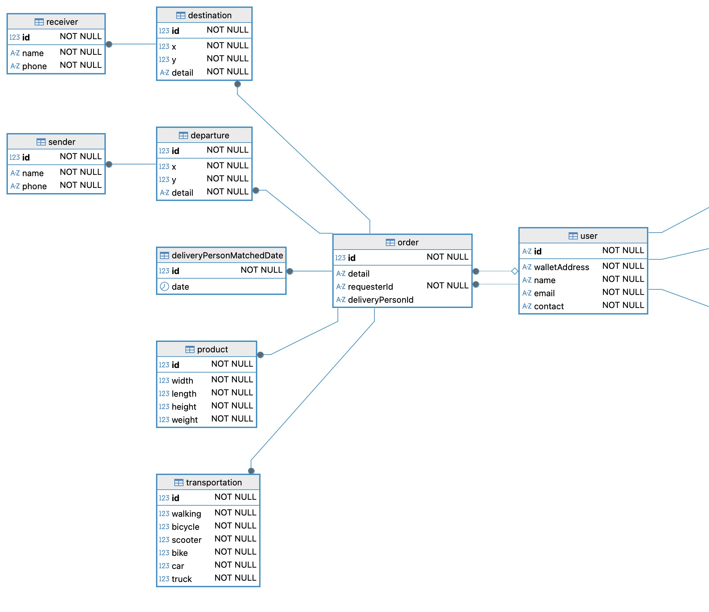

## 4차 부하 테스트: 역정규화로 RDS 병목을 해결, 최대 TPS 2배 향상

> ##### 2025.09.12 ~ 2025.09.15 (4일)

4차 부하 테스트는 [3차 부하 테스트](<3차 부하 테스트: 서버 인스턴스 커넥션 풀 조정으로 제한된 환경에서 TPS 40프로 증가.md>)보다 **가상 사용자를 1,400 → 3,000으로 늘렸습니다.**

> ### 부하 테스트 환경
> 
> #### 테스트 대상
> 
> "배송원이 배송 가능한 의뢰를 조회하는 기능"은 배송원이 의뢰인의 의뢰를 수락하기 위해 반드시 사용하는 서비스의 핵심 기능으로 **가장 요청이 많아 응답시간과 TPS가 중요**합니다.
> 
> #### 인스턴스 사양
> 
> - `AWS EC2 t2.micro` - Ubuntu
> - `AWS RDS db.t4g.micro` - MySQL Community
> 
> #### DB에 저장된 데이터
> 
> - order 테이블 1,000만 레코드 (10%는 배송 가능한 주문)
> - user 테이블 20만 레코드 (1명당 50주문)
> 
> ### k6 부하 테스트 시나리오
> 
> #### 스테이지
> 
> 1. 4분 동안 가상 사용자 **3,000명까지 증가**
> 2. 2분 동안 가상 사용자 **3,000명 유지**
> 3. 1분 동안 가상 사용자 **300명까지 감소**
> 
> #### 이러레이션
> 
> - 이러레이션마다 10회 요청
> - 요청마다 1초 sleep, 다음 요청에는 페이지네이션 파라미터를 20씩 증가
> - 이터레이션 종료 시 페이지네이션 파라미터는 0으로 초기화

### 문제

3차 부하 테스트에서 **커넥션 문제를 해결하고 최대 TPS를 1,400까지 향상**시켰으나, `RDS db.t4g.micro`의 **CPU 사용률은 여전히 80~90**%로 문제가 있었습니다.

**RDS CPU 사용률 (3차 테스트 최적화 이후)**

### 해결

RDS 병목 해결 방법으로 쿼리 튜닝(커서 기반 페이지네이션, 멀터 컬럼 인덱스, 역정규화), DB 캐싱(Redis), RDS 스케일 업/아웃 등을 고려했으나 아래와 같은 이유로 **쿼리 튜닝**을 진행했습니다.

- **목적:** AWS 프리티어로 비용을 최대한 줄이면서 최대 성능 달성
- **DB 캐싱(Redis), RDS 스케일 업/아웃: 인프라 추가로 병목 지점이 늘어 장애 발생 시 원인 파악이 어려울 수 있음**
- **쿼리 튜닝:** **별도 인프라 추가 없이 성능을 향상**시킬 수 있으나, 데이터 이관 등의 작업 필요

쿼리 튜닝을 할때, 적은 비용으로 문제를 해결할 가능성이 있기 때문에 작업 비용이 적은 순서대로 진행했습니다.

#### 1차 시도: 커서 기반 페이지네이션, 멀티 컬럼 인덱스

`OFFSET` 기반 페이지네이션 → 커서 기반 페이지네이션, 멀티 컬럼 인덱스를 설정했고, 이유는 아래와 같습니다.

- **커서 기반 페이지네이션:** `OFFSET`은 **뒤 페이지로 갈수록 성능 저하** 발생, **무한 스크롤에서 같은 내용 중복** 조회 발생
- **멀티 컬럼 인덱스:** 인덱스를 사용할 수 있는 조건은 `배송원의 지갑주소 = null` 말고 없으나, **`주문 아이디`를 추가하고 + 역순 정렬** 멀티 컬럼 인덱스로 성능 향상을 기대함
  - `의뢰 요청자 != 배송원의 지갑주소`는 인덱스를 사용할 수 없지만, 실제로 무의미한지 궁금해서 인덱스에 포함시키고 다른 DB에서 부하 테스트 진행

부하 테스트 결과는 **둘 다 기존과 성능이 비슷하거나 오히려 떨어졌습니다.**

**커서 기반 페이지네이션 + 멀티 컬럼 인덱스 테스트 결과: `(deliveryPersonId, id DESC);`**

.png>)

**커서 기반 페이지네이션 + 멀티 컬럼 인덱스 테스트 결과: `(deliveryPersonId, requesterId, id DESC);`**

.png>)

#### 2차 시도: 역정규화로 `JOIN` 연산 최소화

4차 부하테스트의 문제는 [1차 부하 테스트처럼 응답 시간이 낮고 RDS CPU 사용률이 높았던 문제](<./1차 부하 테스트: 인덱스로 RDS CPU 사용률 60프로 감소, 최대 TPS 9배 증가.md#해결>)와 매우 유사합니다. 당시 **응답 시간이 짧아 문제가 아니라고 생각했는데, 실제로는 RDS CPU에 많은 부하를 주었습니다.** 따라서, 원인을 **과도한 `JOIN`으로 인한 CPU 사용률 증가**로 판단했고 역정규화를 시도했습니다.

역정규화 시 "배송원이 배송 가능한 의뢰 조회"의 **응답 데이터가 다른 API의 응답과 유사해 전반적인 성능 향상**으로 이어진다 판단했습니다. 그래서 "배송원이 배송 가능한 의뢰 조회"가 사용하는 데이터를 역정규화 했고 **그 외 연관된 데이터는 별도 테이블로 분리**했습니다.

**정규화 전**

**정규화 후**

역정규화 적용 후, **최대 TPS를 1,400 → 3,000까지 향상**시켰습니다.

**역정규화 적용 후 k6 부하 테스트 결과**

